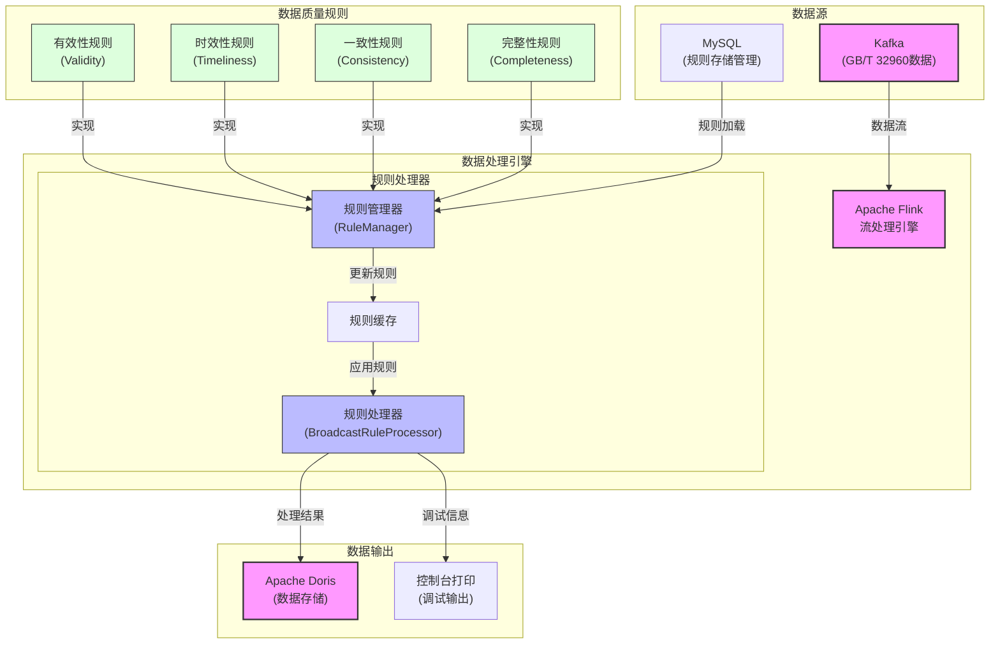
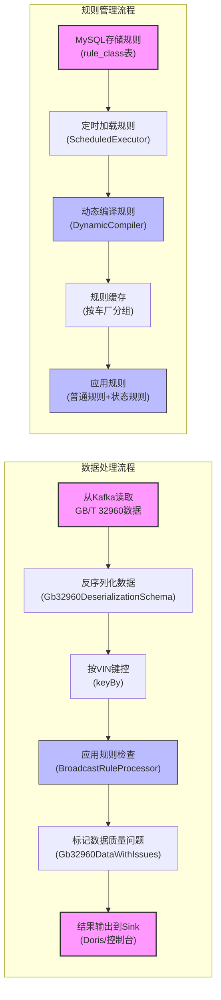

# 电池数据质量分析系统

## 系统概述
电池数据质量分析系统是一个基于Apache Flink的流处理应用，用于实时接收、处理和分析GB/T 32960电动汽车国标数据。系统主要功能是对接收到的车辆电池数据进行质量检查，发现数据中的问题并将结果输出到Doris数据库中进行存储和后续分析。

## 系统架构

系统采用典型的流处理架构，主要包含以下组件：

1. **数据源**：Kafka消息队列，接收GB/T 32960格式的车辆数据
2. **规则源**：MySQL数据库，存储和管理数据质量检查规则
3. **处理引擎**：Apache Flink，实现流式数据处理
4. **数据存储**：Apache Doris，存储处理结果和质量问题

系统整体架构如下图所示：

```
Kafka(GB32960数据) --> Flink处理引擎 --> Doris存储系统
                     ^
                     |
MySQL(规则定时加载) ---+
```

## 核心组件说明

### 1. 数据模型

系统主要处理两类数据：

- **Gb32960Data**: 国标32960格式的电池数据实体类
  - `time`: 数据采集时间，String类型，格式为"yyyy-MM-dd HH:mm:ss"，在规则计算时需要转换为时间戳
  - `ctime`: 数据处理时间，String类型，格式为"yyyy-MM-dd HH:mm:ss"，在规则计算时需要转换为时间戳
- **Gb32960DataWithIssues**: 处理后的数据，包含原始数据和检测到的质量问题
- **Issue**: 表示数据质量异常的详细信息

### 2. 数据质量规则

系统支持多种类型的数据质量规则检查：

- **完整性规则 (Completeness)**: 检查数据是否完整，例如缺少必要的字段
- **一致性规则 (Consistency)**: 检查数据内部是否一致，例如数组长度与声明的计数是否一致
- **时效性规则 (Timeliness)**: 检查数据的时间属性，例如数据延迟、时间戳单调性
- **有效性规则 (Validity)**: 检查数据值是否在合法范围内，例如SOC、电压、温度等

规则通过注解方式定义，支持动态加载和配置。

### 3. 处理流程

1. 从Kafka读取GB/T 32960数据
2. 定时从MySQL读取规则配置
3. 对数据应用质量规则检查
4. 标记质量问题并输出结果到Doris

### 4. 规则管理

系统采用简化的规则管理机制：

- **规则存储**：规则直接存储在MySQL数据库中，以规则ID为主键
- **规则加载**：系统在启动时加载所有规则，并按配置的时间间隔定时刷新规则
- **规则应用**：每条数据到达时，系统应用所有适用的规则进行检查

这种设计相比广播流的方式更加简单直观，便于维护和调试。

### 5. Sink抽象

系统使用Sink接口抽象数据输出逻辑，通过SinkFactory创建适当的Sink实现。目前支持以下Sink类型：

- **DorisSink**: 将数据写入Doris数据库
- **PrintSink**: 将数据打印到控制台，支持简洁和详细两种模式
- **MultipleSink**: 将数据同时发送到多个Sink（例如同时写入数据库并打印到控制台）

Sink接口设计为返回SinkFunction，便于与Flink的流处理API集成。可通过配置参数`sink.type`选择不同的Sink类型：
- `doris`: 使用DorisSink (默认)
- `print`: 使用PrintSink
- `both`: 同时使用DorisSink和PrintSink

对于PrintSink，可通过以下参数进行配置：
- `print.identifier`: 输出标识符，默认为"质量检查结果"
- `print.verbose`: 是否打印详细信息，默认为false

## 配置说明

系统配置通过application.yml文件提供，主要包含：

- **Kafka配置**: 连接信息、消费组、主题等
- **处理配置**: 并行度、状态保留时间、检查点间隔等
- **MySQL配置**: 数据库连接信息、连接池配置等
- **Doris配置**: 连接信息、批处理大小、批处理间隔等
- **Sink配置**: Sink类型及其特定配置

## 部署与运行

### 环境要求

- Java 8+
- Apache Flink 1.13+
- Apache Kafka
- MySQL 5.7+
- Apache Doris

### 编译部署

```bash
# 编译
mvn clean package

# 运行
flink run -c org.battery.DataQualityApplication target/data-quality-process-1.0-SNAPSHOT.jar
```

## Doris建表语句

```sql
-- 创建数据库
CREATE DATABASE IF NOT EXISTS battery_data;

-- 创建单一的数据表，包含原始数据和质量问题信息
CREATE TABLE battery_ods.error_data (
                                        vin varchar(255),
                                        ctime datetime,
                                        time datetime,
                                        vehicleFactory varchar(255),
                                        vehicleStatus INT,
                                        chargeStatus INT,
                                        speed INT,
                                        mileage INT,
                                        totalVoltage INT,
                                        totalCurrent INT,
                                        soc INT,
                                        dcStatus INT,
                                        gears INT,
                                        insulationResistance INT,
                                        operationMode INT,
                                        batteryCount INT,
                                        batteryNumber INT,
                                        cellCount INT,
                                        maxVoltagebatteryNum INT,
                                        maxVoltageSystemNum INT,
                                        batteryMaxVoltage INT,
                                        minVoltagebatteryNum INT,
                                        minVoltageSystemNum INT,
                                        batteryMinVoltage INT,
                                        maxTemperature INT,
                                        maxTemperatureNum INT,
                                        maxTemperatureSystemNum INT,
                                        minTemperature INT,
                                        minTemperatureNum INT,
                                        minTemperatureSystemNum INT,
                                        subsystemVoltageCount INT,
                                        subsystemVoltageDataNum INT,
                                        subsystemTemperatureCount INT,
                                        subsystemTemperatureDataNum INT,
                                        temperatureProbeCount INT,
                                        longitude BIGINT,
                                        latitude BIGINT,
                                        customField String,
                                        cellVoltages array<int>,
                                        probeTemperatures array<int>,
                                        deviceFailuresCodes array<int>,
                                        driveMotorFailuresCodes array<int>,
                                        issues ARRAY<String> , -- JSON格式的质量问题列表
                                        issues_count INT -- 数据质量问题总数
)
    DUPLICATE KEY(vin, ctime)
PARTITION BY RANGE(time)()
DISTRIBUTED BY HASH(`vin`) BUCKETS AUTO
PROPERTIES (
"replication_allocation" = "tag.location.offline: 1",
"min_load_replica_num" = "-1",
"bloom_filter_columns" = "ctime",
"is_being_synced" = "false",
"dynamic_partition.enable" = "true",
"dynamic_partition.time_unit" = "DAY",
"dynamic_partition.time_zone" = "Asia/Shanghai",
"dynamic_partition.start" = "-90",
"dynamic_partition.end" = "2",
"dynamic_partition.prefix" = "p",
"dynamic_partition.replication_allocation" = "tag.location.offline: 1",
"dynamic_partition.buckets" = "10",
"dynamic_partition.create_history_partition" = "false",
"dynamic_partition.history_partition_num" = "-1",
"dynamic_partition.reserved_history_periods" = "NULL",
"dynamic_partition.storage_policy" = "",
"storage_medium" = "hdd",
"storage_format" = "V2",
"inverted_index_storage_format" = "V1",
"compression" = "ZSTD",
"light_schema_change" = "true",
"disable_auto_compaction" = "false",
"enable_single_replica_compaction" = "false",
"group_commit_interval_ms" = "10000",
"group_commit_data_bytes" = "134217728"
);
```

## 最近更新

### 规则管理简化 (2024-06-30)

为提高系统的可维护性和稳定性，对规则管理机制进行了以下简化：

1. **规则存储简化**：
   - 移除了规则表中的版本号和MD5字段
   - 规则表主键改为仅使用ID，每次更新直接覆盖现有规则

2. **规则加载机制变更**：
   - 取消了广播流更新机制
   - 改为在处理器启动时加载规则，并定时刷新规则
   - 使用ScheduledExecutorService实现定时更新

3. **好处**：
   - 简化了系统架构，减少了潜在的错误点
   - 降低了维护难度
   - 提高了系统的可理解性和稳定性

这次更新使系统更加简洁高效，同时保持了规则动态更新的能力。

### 时间字段格式变更 (2023-07-01)

为提高数据可读性和使用便利性，系统对时间字段进行了以下更新：

1. **时间字段格式变更**：
   - 将 `time` 和 `ctime` 字段从时间戳(Long)改为String类型，格式为"yyyy-MM-dd HH:mm:ss"
   - 这些字段在存储和展示时使用字符串格式，便于直观查看

2. **规则适配**：
   - 更新了所有涉及时间字段的规则，使每个规则内部负责解析字符串时间为时间戳
   - 所有规则类中使用SimpleDateFormat解析字符串格式的时间，进行计算后再生成结果
   - 增加了异常处理，提高系统稳定性

3. **好处**：
   - 提高了数据的可读性
   - 允许以更自然的方式查询和过滤数据
   - 保持了时间计算的准确性
此更新使得数据在显示和存储时更加直观，便于阅读和理解，同时通过在规则内部解析时间戳的方式保证了计算的准确性。

## 系统技术方案规划

### 当前系统流程图

1. **系统整体架构**



2. **数据处理与规则管理流程**



### 未来系统规划

#### 1. 近期优化计划（1-3个月）

1. **性能优化**
   - 优化规则缓存机制，减少规则更新时的资源消耗
   - 引入多级缓存，减少数据库访问频率
   - 实现规则优先级排序，优先执行重要规则

2. **规则管理增强**
   - 开发规则可视化管理界面，便于非技术人员维护规则
   - 增加规则测试功能，允许在应用前验证规则有效性
   - 实现规则版本控制，支持规则回滚

3. **监控告警完善**
   - 实现规则执行性能监控，识别低效规则
   - 增加系统健康度监控，及时发现潜在问题
   - 设置数据质量告警阈值，当质量问题超过阈值时触发告警

#### 2. 中期发展规划（3-6个月）

1. **数据质量评分体系**
   - 建立车辆数据质量评分模型，为每辆车分配质量得分
   - 实现车厂、批次、车型等多维度质量分析
   - 开发质量趋势分析功能，识别数据质量变化趋势

2. **规则自动生成**
   - 研发基于历史数据的规则自动推荐功能
   - 实现异常模式自动检测，辅助规则创建
   - 开发规则效果评估系统，量化规则价值

3. **系统弹性扩展**
   - 优化系统横向扩展能力，支持更大规模数据处理
   - 实现资源动态分配，根据负载自动调整资源
   - 增强故障恢复机制，提高系统可用性

#### 3. 长期战略（6-12个月）

1. **AI辅助质量分析**
   - 引入机器学习模型，预测潜在数据质量问题
   - 实现智能根因分析，自动识别质量问题来源
   - 开发异常模式学习功能，持续优化检测能力

2. **数据质量闭环管理**
   - 构建从数据采集到质量反馈的完整闭环
   - 实现质量问题自动分配和跟踪
   - 开发数据质量改进建议系统

3. **生态系统整合**
   - 与数据治理平台整合，形成统一数据质量管理体系
   - 开发开放API，允许第三方系统接入
   - 实现与业务系统的深度整合，将数据质量与业务价值关联

### 技术实施路径

1. **基础架构升级**
   - 升级Flink版本至最新稳定版
   - 引入容器化部署，使用Kubernetes管理服务
   - 实现配置中心化管理，便于环境切换

2. **开发流程优化**
   - 建立自动化测试流程，提高代码质量
   - 实现CI/CD流水线，加速迭代与部署
   - 引入代码审查机制，确保代码质量

3. **团队能力建设**
   - 培养大数据技术专家团队
   - 建立规则开发与维护的最佳实践
   - 定期技术分享与培训，提升团队整体技术水平

### 关键成功指标

1. **技术指标**
   - 系统吞吐量：支持每秒10万条以上数据处理
   - 延迟性能：平均处理延迟控制在100ms以内
   - 可用性：系统可用性达到99.9%以上

2. **业务指标**
   - 数据质量覆盖率：100%车辆数据接入质量检测
   - 问题识别准确率：质量问题识别准确率达95%以上
   - 质量改进效果：车辆数据质量问题减少50%以上

通过以上规划，我们将建立一个高效、可靠、智能的电池数据质量分析平台，为电动汽车数据管理提供坚实保障，促进电动汽车行业的健康发展。
