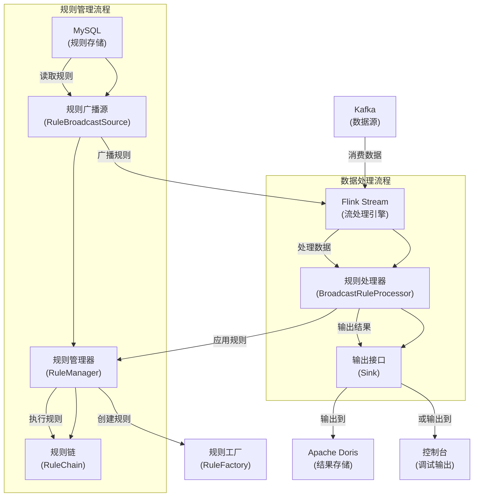

# 电池数据质量分析系统

## 项目概述

电池数据质量分析系统是一个基于Apache Flink的实时数据质量检测框架，主要用于对车辆电池国标32960数据进行质量检测和异常识别。系统能够实时处理来自Kafka的电池数据流，应用动态配置的数据质量规则，识别数据中的异常情况，并将结果输出到指定存储系统（如Apache Doris）。

## 系统架构

系统主要由以下几个部分组成：

1. **数据源模块**：从Kafka消费国标32960电池数据
2. **规则管理模块**：管理和应用数据质量规则
3. **数据处理模块**：使用Flink进行实时数据处理
4. **结果存储模块**：将数据质量检测结果存储到目标系统

### 架构图



### 技术栈

- **Apache Flink**：实时流处理框架
- **Apache Kafka**：消息队列，数据源
- **MySQL**：存储规则元数据
- **Apache Doris**：存储数据质量检测结果

## 核心功能

### 1. 规则管理

系统支持多种数据质量规则类型：

- **完整性规则（Completeness）**：检查数据是否完整，字段是否缺失
  - 电池电压数据缺失检测
  - 探针温度数据缺失检测
  - 地理坐标数据缺失检测

- **一致性规则（Consistency）**：检查数据各部分之间是否保持一致性
  - 电池电压长度与电池数量一致性检测
  - 探针温度长度与探针数量一致性检测
  - 充电状态一致性检测
  - 采样间隔一致性检测

- **及时性规则（Timeliness）**：检查数据的时间属性
  - 数据延迟检测（数据上传时间是否超过阈值）
  - 数据提前检测（数据时间是否超前于当前时间）
  - 时间戳单调性检测（确保数据时间戳按顺序递增）

- **有效性规则（Validity）**：检查数据值是否在合理范围内
  - 总电压有效性检测
  - 总电流有效性检测
  - SOC有效性检测（电量百分比）
  - 最高/最低温度有效性检测
  - 最高/最低电压有效性检测
  - 车速有效性检测
  - 里程有效性检测
  - 绝缘电阻有效性检测

系统支持动态规则管理：

- 规则可根据车厂分别启用或禁用
- 规则可动态更新，无需重启系统
- 支持规则版本管理

### 2. 数据处理

- 采用Flink流处理架构，实时处理数据
- 使用广播状态（Broadcast State）分发规则更新
- 支持有状态处理，可以处理需要比较前后数据的规则

### 3. 扩展性设计

系统采用多种设计模式确保扩展性：

- **工厂模式**：用于创建规则和输出接口
- **适配器模式**：统一规则接口
- **观察者模式**：处理规则更新通知
- **责任链模式**：构建规则执行链
- **策略模式**：根据规则类型选择不同的执行策略

## 快速开始

### 环境要求

- JDK 8+
- Apache Flink 1.13+
- MySQL 8.0+
- Apache Kafka

### 配置说明

在`src/main/resources/application.yml`中配置：

```yaml
# Kafka配置
kafka:
  bootstrapServers: [服务器地址]
  topic: [主题名称]
  groupId: [消费组ID]

# 数据库配置
mysql:
  url: [MySQL连接URL]
  username: [用户名]
  password: [密码]

# 输出配置
sink:
  # 选择使用的Sink类型: doris, print
  type: [doris或print]
```

### 运行步骤

1. **编译项目**

```bash
mvn clean package
```

2. **准备数据库**

- 执行`src/main/resources/db/schema.sql`创建必要的MySQL数据库和表结构。
- 执行`src/main/resources/db/doris_schema.sql`在Apache Doris中创建结果表。

3. **启动系统**

```bash
java -jar target/data-quality-process-1.0-SNAPSHOT.jar
```

或者提交到Flink集群运行：

```bash
flink run -c org.battery.DataQualityApplication target/data-quality-process-1.0-SNAPSHOT.jar
```

## 自定义规则开发

### 创建新规则

1. 在`org.battery.quality.rule.impl`包下创建规则类
2. 实现`Rule`接口或继承`AbstractRule`
3. 使用`@QualityRule`注解标注规则信息

示例：

```java
@QualityRule(
    type = "soc_validity",
    name = "SOC有效性规则",
    description = "检查SOC值是否在合理范围内",
    category = "validity",
    ruleCode = 1001
)
public class SocValidityRule extends AbstractRule {
    @Override
    public Optional<Issue> check(Gb32960Data data, Gb32960Data previousData) {
        // 实现规则逻辑
    }
}
```

### 规则注册

系统启动时会自动扫描带有`@QualityRule`注解的类，并将它们注册到规则管理系统中。

## 系统管理

### 规则管理

- 通过MySQL数据库直接管理规则
- 可通过更新`rule_class`表中的`enabled_factories`字段控制规则的启用/禁用

### 数据质量分析

系统将检测到的异常数据保存至Apache Doris的`error_data`表，可以通过以下方式进行分析：

- 使用`src/main/resources/db/statistics_queries.sql`中提供的SQL进行数据分析
- 主要分析维度包括：
  - 按车厂统计异常数量
  - 按时间分析异常趋势
  - 异常类型统计分析
  - 特定车辆的异常历史记录
  - 高频异常车辆排名
  - 异常严重程度分布

### 监控和日志

系统使用SLF4J和Logback进行日志记录，日志文件位于`logs`目录下。

## 项目结构

```
├── src/main/java/org/battery/
│   ├── DataQualityApplication.java    # 主应用程序入口
│   └── quality/
│       ├── config/                    # 配置相关类
│       ├── model/                     # 数据模型
│       ├── processor/                 # 数据处理器
│       ├── rule/                      # 规则相关
│       │   ├── adapter/               # 规则适配器
│       │   ├── annotation/            # 规则注解
│       │   ├── chain/                 # 规则链
│       │   ├── factory/               # 规则工厂
│       │   ├── impl/                  # 规则实现
│       │   │   ├── completeness/      # 完整性规则
│       │   │   ├── consistency/       # 一致性规则
│       │   │   ├── timeliness/        # 及时性规则
│       │   │   └── validity/          # 有效性规则
│       │   ├── observer/              # 规则观察者
│       │   ├── service/               # 规则服务
│       │   ├── strategy/              # 规则策略
│       │   └── template/              # 规则模板
│       ├── sink/                      # 输出接口
│       ├── source/                    # 数据源
│       └── util/                      # 工具类
```

## 常见问题

1. **规则不生效？**
   - 检查规则是否正确注册到数据库
   - 检查车厂ID是否已启用该规则

2. **数据处理延迟高？**
   - 调整Flink并行度参数
   - 检查规则执行效率

3. **如何添加新的输出目标？**
   - 实现`Sink`接口
   - 在`SinkFactory`中注册新的Sink实现


## 许可证

[添加许可证信息] 