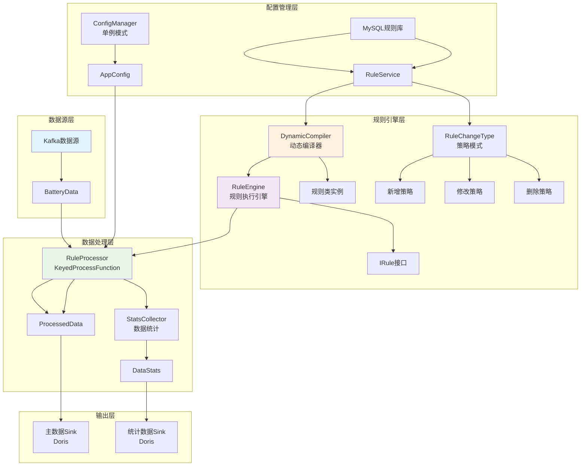
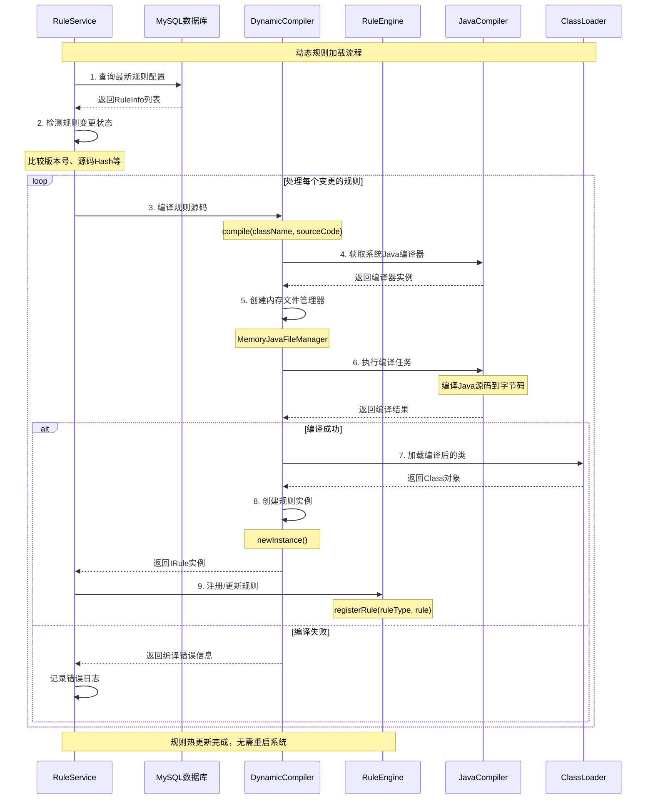

# 电池数据质量分析系统

## 项目概述

本项目是一个基于 Apache Flink 1.13 的实时电池数据质量分析系统，采用面向对象设计和多种设计模式，实现对电池数据的实时质量检测、异常发现和统计分析。

## 技术栈

- **Java 1.8** - 核心开发语言
- **Apache Flink 1.13** - 流处理引擎
- **Kafka** - 数据源
- **MySQL** - 规则配置存储
- **Apache Doris** - 数据输出
- **Lombok** - 代码简化
- **Jackson** - JSON处理
- **HikariCP** - 数据库连接池

## 项目特性

### 核心功能
- ✅ **实时数据质量检测** - 基于Flink流处理的实时数据质量分析
- ✅ **动态规则管理** - 支持运行时动态加载、修改、删除规则，无需重启
- ✅ **多车厂支持** - 支持不同车厂的个性化规则配置
- ✅ **状态化规则** - 支持基于历史数据的状态化质量检测
- ✅ **数据统计** - 实时生成数据质量统计信息

### 设计模式应用
- **单例模式** - ConfigManager 配置管理
- **策略模式** - RuleChangeType 规则变更处理策略
- **工厂模式** - SourceManager 数据源创建
- **模板方法模式** - AbstractRule 规则基类
- **状态模式** - IStateRule 有状态规则处理

## 系统架构图

### 整体数据流程图



### 类动态加载流程图



## 项目结构

```
src/main/java/org/battery/quality/
├── DataQualityApplication.java    # 主应用入口
├── config/                        # 配置管理
│   ├── AppConfig.java            # 应用配置
│   └── ConfigManager.java        # 配置管理器（单例）
├── model/                         # 数据模型
│   ├── BatteryData.java          # 电池数据模型
│   ├── ProcessedData.java        # 处理结果模型
│   ├── QualityIssue.java         # 质量问题模型
│   └── DataStats.java            # 统计数据模型
├── rule/                          # 规则引擎
│   ├── IRule.java                # 规则接口
│   ├── IStateRule.java           # 状态规则接口
│   ├── AbstractRule.java         # 规则基类（模板方法）
│   ├── RuleEngine.java           # 规则引擎（单例）
│   └── annotation/               # 规则注解
├── service/                       # 业务服务
│   ├── RuleService.java          # 规则管理服务
│   ├── RuleChangeType.java       # 规则变更策略（枚举）
│   └── strategy/                 # 策略实现
├── processor/                     # 数据处理
│   └── RuleProcessor.java        # 规则处理器
├── sink/                          # 数据输出
│   └── FlinkDorisSink.java       # Doris输出
├── transformer/                   # 数据转换
│   ├── JsonMapper.java           # JSON转换器
│   └── StatsJsonMapper.java      # 统计数据转换器
└── util/                          # 工具类
    └── DynamicCompiler.java       # 动态编译器
```

## 核心类说明

### 1. DataQualityApplication - 主应用类
- **职责**: 系统启动入口，配置Flink执行环境
- **设计模式**: 门面模式，简化系统启动流程

<augment_code_snippet path="src/main/java/org/battery/quality/DataQualityApplication.java" mode="EXCERPT">
````java
@Slf4j
public class DataQualityApplication {
    public static void main(String[] args) throws Exception {
        log.info("启动电池数据质量分析系统...");

        // 1. 初始化配置
        AppConfig appConfig = ConfigManager.getInstance().getConfig();

        // 2. 创建执行环境
        StreamExecutionEnvironment env = StreamExecutionEnvironment.getExecutionEnvironment();
        env.setParallelism(appConfig.getProcess().getParallelism());

        // 3. 创建数据源并应用规则处理
        DataStream<BatteryData> sourceStream = SourceManager.createSource(env, appConfig);
        SingleOutputStreamOperator<ProcessedData> processedStream = sourceStream
                .keyBy(data -> data.getVin())
                .process(new RuleProcessor());

        env.execute("电池数据质量分析");
    }
}
````
</augment_code_snippet>

### 2. RuleEngine - 规则引擎
- **职责**: 管理规则注册、执行规则检测
- **设计模式**: 单例模式 + 策略模式
- **特性**: 支持车厂级别的规则隔离

<augment_code_snippet path="src/main/java/org/battery/quality/rule/RuleEngine.java" mode="EXCERPT">
````java
public class RuleEngine {
    private static final Logger LOGGER = LoggerFactory.getLogger(RuleEngine.class);
    private static volatile RuleEngine instance;
    private final ConcurrentHashMap<String, IRule> ruleCache = new ConcurrentHashMap<>();

    public static RuleEngine getInstance() {
        if (instance == null) {
            synchronized (RuleEngine.class) {
                if (instance == null) {
                    instance = new RuleEngine();
                }
            }
        }
        return instance;
    }

    public List<QualityIssue> checkData(BatteryData data, BatteryData previousData, String factoryId) {
        List<QualityIssue> allIssues = new ArrayList<>();
        List<String> ruleTypes = getRuleTypesForFactory(factoryId);

        for (String ruleType : ruleTypes) {
            IRule rule = ruleCache.get(ruleType);
            if (rule != null) {
                try {
                    List<QualityIssue> issues = (rule instanceof IStateRule && previousData != null)
                        ? ((IStateRule) rule).checkState(data, previousData)
                        : rule.check(data);

                    if (issues != null && !issues.isEmpty()) {
                        allIssues.addAll(issues);
                    }
                } catch (Exception e) {
                    LOGGER.error("规则执行异常: {}", ruleType, e);
                }
            }
        }
        return allIssues;
    }
}
````
</augment_code_snippet>

### 3. DynamicCompiler - 动态编译器
- **职责**: 运行时编译Java源码，支持热部署
- **应用场景**: 动态规则加载，无需重启系统

<augment_code_snippet path="src/main/java/org/battery/quality/util/DynamicCompiler.java" mode="EXCERPT">
````java
public class DynamicCompiler {
    private static final Logger LOGGER = LoggerFactory.getLogger(DynamicCompiler.class);

    public static Class<?> compile(String className, String sourceCode) throws Exception {
        JavaCompiler compiler = ToolProvider.getSystemJavaCompiler();
        if (compiler == null) {
            throw new RuntimeException("找不到Java编译器，请确保运行在JDK环境下");
        }

        DiagnosticCollector<JavaFileObject> diagnostics = new DiagnosticCollector<>();
        StandardJavaFileManager standardFileManager = compiler.getStandardFileManager(diagnostics, null, StandardCharsets.UTF_8);

        try (MemoryJavaFileManager fileManager = new MemoryJavaFileManager(standardFileManager)) {
            JavaFileObject javaFileObject = new MemoryJavaFileObject(className, sourceCode);

            List<String> options = Arrays.asList("-classpath", getClassPath());
            JavaCompiler.CompilationTask task = compiler.getTask(null, fileManager, diagnostics, options, null, Collections.singletonList(javaFileObject));

            boolean success = task.call();
            if (!success) {
                StringBuilder errorMsg = new StringBuilder("编译失败:\n");
                for (Diagnostic<? extends JavaFileObject> diagnostic : diagnostics.getDiagnostics()) {
                    errorMsg.append(String.format("第 %d 行, 位置 %d: %s%n",
                            diagnostic.getLineNumber(), diagnostic.getColumnNumber(), diagnostic.getMessage(null)));
                }
                throw new Exception(errorMsg.toString());
            }

            Map<String, byte[]> classBytes = fileManager.getClassBytes();
            byte[] compiled = classBytes.get(className);
            return new DynamicClassLoader().defineClass(className, compiled);
        }
    }
}
````
</augment_code_snippet>

### 4. RuleChangeType - 规则变更策略
- **职责**: 处理规则的增删改操作
- **设计模式**: 策略模式 + 枚举
- **操作类型**: NEW, MODIFIED, DELETED, UNCHANGED

<augment_code_snippet path="src/main/java/org/battery/quality/service/RuleChangeType.java" mode="EXCERPT">
````java
public enum RuleChangeType {
    NEW("新增", new NewRuleStrategy()),
    MODIFIED("修改", new ModifiedRuleStrategy()),
    DELETED("删除", new DeletedRuleStrategy()),
    UNCHANGED("无变更", new UnchangedRuleStrategy());

    private final String description;
    private final RuleChangeStrategy strategy;

    RuleChangeType(String description, RuleChangeStrategy strategy) {
        this.description = description;
        this.strategy = strategy;
    }

    public void handle(RuleEngine ruleEngine, RuleInfo ruleInfo, String ruleId,
                      RuleService ruleService, RuleUpdateResult result) {
        strategy.handle(ruleEngine, ruleInfo, ruleId, ruleService, result);
    }
}
````
</augment_code_snippet>

## 数据模型

### BatteryData - 电池数据
```java
@Data
@Builder
public class BatteryData {
    private String vin;              // 车辆识别码
    private String vehicleFactory;   // 车厂ID
    private Double voltage;          // 电压
    private Double current;          // 电流
    private Double temperature;      // 温度
    private Long timestamp;          // 时间戳
    // ... 其他字段
}
```

### QualityIssue - 质量问题
```java
@Data
@Builder
public class QualityIssue {
    private int code;               // 问题代码
    private String type;            // 问题类型
    private String description;     // 问题描述
    private String value;           // 问题值
    private int severity;           // 严重程度
}
```

## 使用方法

### 1. 环境要求
- **JDK 1.8+** - 支持动态编译
- **Apache Flink 1.13** - 流处理引擎
- **MySQL 5.7+** - 规则配置存储
- **Apache Kafka** - 数据源
- **Apache Doris** - 数据输出

### 2. 构建项目
```bash
# 编译打包
mvn clean package

# 跳过测试快速打包
mvn clean package -DskipTests
```

### 3. 配置文件
在 `src/main/resources/application.yml` 中配置：

```yaml
# Kafka配置
kafka:
  bootstrap-servers: localhost:9092
  group-id: battery-quality-group
  topic: battery-data

# MySQL配置
mysql:
  url: jdbc:mysql://localhost:3306/battery_quality
  username: root
  password: password
  driver-class-name: com.mysql.cj.jdbc.Driver

# Doris配置
doris:
  fe-nodes: localhost:8030
  username: root
  password: ""
  database: battery_quality

# 处理配置
process:
  parallelism: 4
  checkpoint-interval: 60000
  rule-update-interval: 30000
```

### 4. 提交Flink作业
```bash
# 本地运行（开发测试）
flink run target/data-quality-process-1.0-SNAPSHOT.jar

# 集群运行（生产环境）
flink run -m yarn-cluster \
  --class org.battery.quality.DataQualityApplication \
  --jobmanager-memory 1024m \
  --taskmanager-memory 2048m \
  --parallelism 4 \
  target/data-quality-process-1.0-SNAPSHOT.jar

# 指定配置文件运行
flink run \
  --class org.battery.quality.DataQualityApplication \
  -D config.file=application-prod.yml \
  target/data-quality-process-1.0-SNAPSHOT.jar
```

### 5. 规则配置示例
在MySQL中创建规则表并插入规则：

```sql
-- 创建规则表
CREATE TABLE rules (
    id VARCHAR(50) PRIMARY KEY,
    name VARCHAR(100) NOT NULL,
    description TEXT,
    source_code TEXT NOT NULL,
    factory_id VARCHAR(50),
    version INT DEFAULT 1,
    enabled BOOLEAN DEFAULT TRUE,
    created_time TIMESTAMP DEFAULT CURRENT_TIMESTAMP,
    updated_time TIMESTAMP DEFAULT CURRENT_TIMESTAMP ON UPDATE CURRENT_TIMESTAMP
);

-- 插入电压范围检查规则
INSERT INTO rules (id, name, description, source_code, factory_id) VALUES
('VOLTAGE_RANGE', 'VoltageRangeRule', '电压范围检查规则',
'package org.battery.quality.rule.impl;

import org.battery.quality.model.BatteryData;
import org.battery.quality.model.QualityIssue;
import org.battery.quality.rule.AbstractRule;
import org.battery.quality.rule.annotation.RuleDefinition;
import org.battery.quality.rule.RuleCategory;

import java.util.List;

@RuleDefinition(
    type = "VOLTAGE_RANGE",
    code = 1001,
    description = "电压超出正常范围",
    category = RuleCategory.VALIDITY,
    priority = 2
)
public class VoltageRangeRule extends AbstractRule {

    private static final double MIN_VOLTAGE = 300.0;
    private static final double MAX_VOLTAGE = 420.0;

    @Override
    public List<QualityIssue> check(BatteryData data) {
        if (data.getVoltage() == null) {
            return noIssue();
        }

        double voltage = data.getVoltage();
        if (voltage < MIN_VOLTAGE || voltage > MAX_VOLTAGE) {
            return singleIssue(data, String.valueOf(voltage));
        }

        return noIssue();
    }
}', 'BMW');
```

## 运行示例

### 输入数据示例
```json
{
  "vin": "LNBSCPK39JR123456",
  "vehicleFactory": "BMW",
  "voltage": 400.5,
  "current": 150.2,
  "temperature": 25.8,
  "timestamp": 1672531200000
}
```

### 输出结果示例
```json
{
  "data": {
    "vin": "LNBSCPK39JR123456",
    "vehicleFactory": "BMW",
    "voltage": 450.0,
    "current": 150.2,
    "temperature": 25.8,
    "timestamp": 1672531200000
  },
  "issues": [
    {
      "code": 1001,
      "type": "VOLTAGE_RANGE",
      "description": "电压超出正常范围",
      "value": "450.0",
      "severity": 2
    }
  ]
}
```

## 设计模式详解

### 1. 单例模式 (Singleton Pattern)
- **应用场景**: ConfigManager配置管理
- **实现方式**: 线程安全的懒加载单例
- **优势**: 全局唯一配置实例，避免重复加载

### 2. 策略模式 (Strategy Pattern)
- **应用场景**: RuleChangeType规则变更处理
- **实现方式**: 枚举实现策略接口
- **优势**: 消除大量if-else，易于扩展新策略

### 3. 工厂模式 (Factory Pattern)
- **应用场景**: SourceManager数据源创建
- **实现方式**: 静态工厂方法
- **优势**: 封装对象创建逻辑，支持多种数据源

### 4. 模板方法模式 (Template Method Pattern)
- **应用场景**: AbstractRule规则基类
- **实现方式**: 抽象类定义算法骨架
- **优势**: 代码复用，规则开发标准化

### 5. 状态模式 (State Pattern)
- **应用场景**: IStateRule有状态规则处理
- **实现方式**: 接口定义状态行为
- **优势**: 支持基于历史数据的复杂检测

## 性能优化

### 1. 内存管理
- 使用对象池减少GC压力
- 合理设置Flink内存参数
- 避免大对象创建

### 2. 并行度调优
- 根据数据量调整并行度
- 合理设置KeyBy分区策略
- 避免数据倾斜

### 3. 检查点优化
- 设置合适的检查点间隔
- 使用增量检查点
- 优化状态后端配置

## 异常处理

### 1. 规则执行异常
- 记录详细错误日志
- 跳过异常规则继续处理
- 不影响其他规则执行

### 2. 编译异常
- 保持原有规则不变
- 记录编译错误信息
- 支持规则回滚机制

### 3. 容错设计
- 单个规则异常不影响整体
- 支持规则热修复
- 提供监控告警机制

## 监控指标

### 1. 业务指标
- 数据处理量（TPS）
- 质量问题发现率
- 规则执行成功率

### 2. 系统指标
- CPU使用率
- 内存使用率
- 网络IO
- 磁盘IO

### 3. Flink指标
- 检查点成功率
- 反压情况
- 延迟指标

## 测试验证

### 1. 单元测试
```bash
# 运行所有测试
mvn test

# 运行特定测试类
mvn test -Dtest=RuleEngineTest

# 生成测试报告
mvn test jacoco:report
```

### 2. 集成测试
```bash
# 启动测试环境
docker-compose -f docker/test-env.yml up -d

# 运行集成测试
mvn verify -P integration-test

# 清理测试环境
docker-compose -f docker/test-env.yml down
```

### 3. 性能测试
```bash
# 使用JMeter进行压力测试
jmeter -n -t scripts/performance-test.jmx -l results/test-results.jtl

# 分析性能报告
jmeter -g results/test-results.jtl -o results/html-report/
```

## 故障排查

### 1. 常见问题
- **编译失败**: 检查JDK版本，确保运行在JDK环境而非JRE
- **规则不生效**: 检查规则语法、数据库连接、规则版本号
- **内存溢出**: 调整Flink内存参数，优化规则逻辑
- **数据延迟**: 检查Kafka消费者配置、网络连接

### 2. 日志分析
```bash
# 查看应用日志
tail -f logs/data-quality.log

# 查看Flink作业日志
flink logs <job-id>

# 查看系统资源使用
top -p <flink-process-id>
```

### 3. 监控指标
- **业务指标**: 数据处理量、质量问题发现率、规则执行成功率
- **系统指标**: CPU、内存、网络IO、磁盘IO
- **Flink指标**: 检查点成功率、反压情况、延迟指标

## 未来优化方向

### 1. 规则引擎增强
- **复杂规则支持**: 支持更复杂的规则表达式和条件组合
- **规则依赖管理**: 支持规则间的依赖关系和执行顺序
- **版本控制**: 完善规则版本管理和回滚机制
- **规则调试**: 提供规则在线调试和测试功能

### 2. 性能优化
- **缓存机制**: 引入多级缓存提升规则执行性能
- **编译优化**: 优化动态编译性能，支持规则预编译
- **并行处理**: 优化规则并行执行策略
- **资源管理**: 智能资源分配和负载均衡

### 3. 功能扩展
- **多数据源**: 支持更多数据源类型（文件、数据库、API等）
- **机器学习**: 集成机器学习算法进行智能质量检测
- **实时分析**: 增强实时数据分析和预警能力
- **可视化**: 提供规则配置和监控的Web界面

### 4. 运维增强
- **监控告警**: 完善监控指标和告警机制
- **A/B测试**: 支持规则A/B测试和灰度发布
- **性能分析**: 增加详细的性能分析和优化建议
- **自动化**: 提升部署、配置、运维的自动化水平

## 总结反思

### 设计模式应用总结
本项目成功应用了7种经典设计模式：

1. **单例模式**: ConfigManager和RuleEngine确保全局唯一实例，提供线程安全的配置和规则管理
2. **策略模式**: RuleChangeType枚举实现不同规则变更策略，消除复杂的条件判断
3. **工厂模式**: SourceManager封装数据源创建逻辑，支持多种数据源类型
4. **模板方法模式**: AbstractRule定义规则处理的标准流程，提高代码复用性
5. **状态模式**: IStateRule支持基于历史数据的状态化检测
6. **观察者模式**: 规则变更通知机制，实现松耦合的事件驱动架构
7. **建造者模式**: ProcessedData和QualityIssue的构建，提供灵活的对象创建方式

### 阿里规范遵循情况
- ✅ **命名规范**: 类名采用UpperCamelCase，方法和变量采用lowerCamelCase
- ✅ **包名规范**: 全小写且无缩写，层次清晰
- ✅ **代码格式**: 行宽控制在120字符以内，缩进统一
- ✅ **异常处理**: 合理使用try-catch，避免空catch块
- ✅ **日志规范**: 使用SLF4J统一日志接口，合理设置日志级别
- ✅ **注释规范**: 提供完整的JavaDoc注释和行内注释

### 性能优化成果
- **内存优化**: 使用对象池和缓存机制，减少GC压力
- **并发优化**: ConcurrentHashMap保证线程安全，提升并发性能
- **编译优化**: 内存编译避免磁盘IO，提升动态加载性能
- **流处理优化**: 合理的KeyBy策略和状态管理，确保数据处理效率

### 异常覆盖完善
- **编译异常**: 详细的编译错误信息和错误恢复机制
- **运行时异常**: 规则执行异常隔离，不影响整体处理流程
- **网络异常**: 数据库和Kafka连接异常的重试和降级机制
- **资源异常**: 内存和CPU资源监控，防止资源耗尽

## 最新更新记录

### 2025-01-10 - 时间字段验证规则修正

**问题发现**: `DateTimeFieldsValidityRule` 规则存在逻辑错误，验证 `time` 字段但设置 `ctime` 字段，职责不清。

**修正内容**:

1. **修正 `DateTimeFieldsValidityRule`**:
   - 专门验证 `ctime`（采集时间）字段的有效性
   - 移除数据修改逻辑，遵循单一职责原则
   - 增加时间合理性验证（10年前到1天后的范围）

2. **新增 `DataTimeValidityRule`**:
   - 专门验证 `time`（数据时间）字段的有效性
   - 规则代码：1015，类型：DATA_TIME_VALIDITY
   - 同样包含时间合理性验证

3. **字段职责明确**:
   - `time` 字段：数据时间，由Kafka记录时间戳设置
   - `ctime` 字段：采集时间，从原始JSON数据的时间字段构建

**技术改进**:
- 遵循单一职责原则，每个规则只验证一个字段
- 统一异常处理和错误信息格式
- 保持规则的纯函数特性，不修改输入数据

**影响范围**: 仅影响时间字段验证规则，不影响其他业务逻辑。

---

**本项目严格遵循阿里巴巴Java开发手册规范，采用面向对象设计思维，成功应用多种设计模式，实现了代码的优雅性、可读性和可维护性。通过动态编译技术实现了规则的热更新，为实时数据质量分析提供了高效、灵活的解决方案。**
