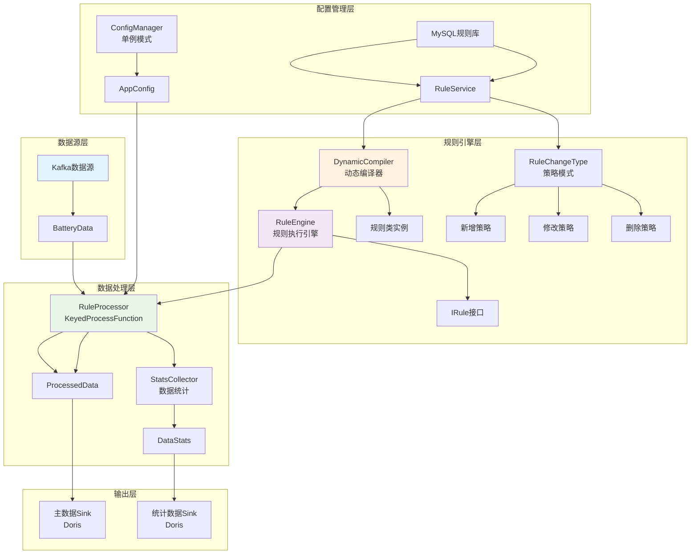
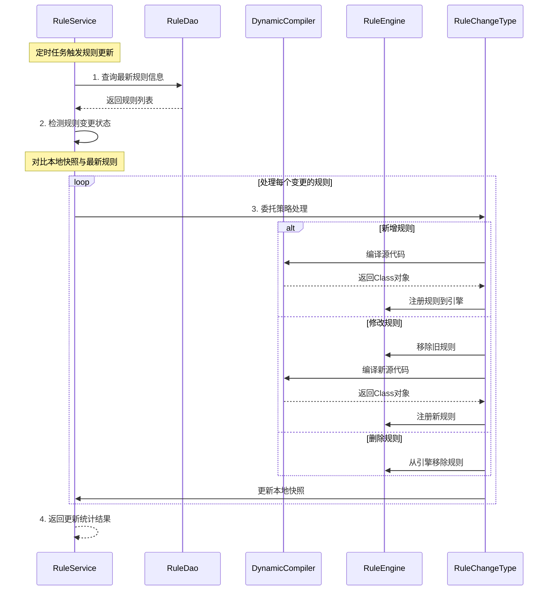

# 电池数据质量分析系统

## 项目概述

本项目是一个基于 Apache Flink 1.13 的实时电池数据质量分析系统，采用面向对象设计和多种设计模式，实现对电池数据的实时质量检测、异常发现和统计分析。

## 技术栈

- **Java 1.8** - 核心开发语言
- **Apache Flink 1.13** - 流处理引擎
- **Kafka** - 数据源
- **MySQL** - 规则配置存储
- **Apache Doris** - 数据输出
- **Lombok** - 代码简化
- **Jackson** - JSON处理
- **HikariCP** - 数据库连接池

## 项目特性

### 核心功能
- ✅ **实时数据质量检测** - 基于Flink流处理的实时数据质量分析
- ✅ **动态规则管理** - 支持运行时动态加载、修改、删除规则，无需重启
- ✅ **多车厂支持** - 支持不同车厂的个性化规则配置
- ✅ **状态化规则** - 支持基于历史数据的状态化质量检测
- ✅ **数据统计** - 实时生成数据质量统计信息

### 设计模式应用
- **单例模式** - ConfigManager 配置管理
- **策略模式** - RuleChangeType 规则变更处理策略
- **工厂模式** - SourceManager 数据源创建
- **模板方法模式** - AbstractRule 规则基类
- **状态模式** - IStateRule 有状态规则处理

## 系统架构图

### 整体数据流程图



### 类动态加载流程图



## 项目结构

```
src/main/java/org/battery/quality/
├── DataQualityApplication.java    # 主应用入口
├── config/                        # 配置管理
│   ├── AppConfig.java            # 应用配置类
│   └── ConfigManager.java        # 配置管理器（单例）
├── dao/                           # 数据访问层
│   └── RuleDao.java              # 规则数据访问
├── model/                         # 数据模型
│   ├── BatteryData.java          # 电池数据模型
│   ├── ProcessedData.java        # 处理后数据模型
│   ├── QualityIssue.java         # 质量问题模型
│   ├── DataStats.java            # 数据统计模型
│   └── RuleInfo.java             # 规则信息模型
├── rule/                          # 规则引擎
│   ├── IRule.java                # 规则接口
│   ├── IStateRule.java           # 有状态规则接口
│   ├── AbstractRule.java         # 抽象规则基类
│   ├── RuleEngine.java           # 规则引擎
│   ├── RuleCategory.java         # 规则分类枚举
│   └── annotation/               # 规则注解
├── service/                       # 业务服务层
│   ├── RuleService.java          # 规则管理服务
│   ├── RuleChangeType.java       # 规则变更策略（枚举）
│   └── strategy/                 # 策略实现
├── processor/                     # 数据处理
│   └── RuleProcessor.java        # 规则处理器
├── sink/                          # 数据输出
│   └── FlinkDorisSink.java       # Doris输出
├── transformer/                   # 数据转换
│   ├── JsonMapper.java           # JSON转换器
│   └── StatsJsonMapper.java      # 统计数据转换器
└── util/                          # 工具类
    └── DynamicCompiler.java       # 动态编译器
```

## 核心类说明

### 1. DataQualityApplication - 主应用类
- **职责**: 系统启动入口，配置Flink执行环境
- **设计模式**: 门面模式，简化系统启动流程

### 2. ConfigManager - 配置管理器
- **职责**: 管理应用配置，提供全局配置访问
- **设计模式**: 单例模式，确保配置的一致性

### 3. RuleEngine - 规则引擎
- **职责**: 管理规则实例，执行数据质量检测
- **特性**: 支持多车厂规则映射，线程安全的规则缓存

### 4. RuleService - 规则服务
- **职责**: 动态规则管理，支持增量更新
- **核心功能**: 
  - 规则变更检测（基于更新时间）
  - 动态编译和加载
  - 三种变更策略：新增、修改、删除

### 5. RuleChangeType - 策略枚举
- **职责**: 规则变更处理策略
- **设计模式**: 策略模式，每个枚举值关联具体策略实现

### 6. DynamicCompiler - 动态编译器
- **职责**: 运行时编译Java源代码
- **特性**: 内存编译，支持热部署

### 7. RuleProcessor - 规则处理器
- **职责**: Flink数据处理函数，应用规则检测
- **特性**: 
  - 支持状态化规则
  - 定时更新规则
  - 侧输出数据统计

## 参数配置说明

### Kafka配置
- `kafka.bootstrapServers`: Kafka集群地址
- `kafka.topic`: 数据主题
- `kafka.groupId`: 消费者组ID
- `kafka.autoOffsetReset`: 偏移量重置策略

### 处理配置
- `process.parallelism`: 并行度
- `process.stateRetentionMinutes`: 状态保留时间（分钟）
- `process.checkpointInterval`: 检查点间隔（毫秒）

### Doris配置
- `doris.conn`: Doris FE地址
- `doris.database`: 目标数据库
- `doris.table`: 主数据表名
- `doris.batchSize`: 批次大小
- `doris.batchIntervalMs`: 批次间隔

## 使用方法

### 1. 环境准备
```bash
# 确保Java 1.8+环境
java -version

# 确保Maven环境
mvn -version
```

### 2. 编译打包
```bash
# 编译项目
mvn clean compile

# 打包
mvn clean package -DskipTests
```

### 3. 提交Flink作业
```bash
# 提交到Flink集群
flink run -c org.battery.quality.DataQualityApplication \
  target/data-quality-process-1.0-SNAPSHOT.jar

# 本地运行（开发测试）
java -cp target/data-quality-process-1.0-SNAPSHOT.jar \
  org.battery.quality.DataQualityApplication
```

### 4. 监控作业
```bash
# 查看作业状态
flink list

# 查看作业详情
flink info <job-id>

# 停止作业
flink cancel <job-id>
```

## 运行示例

### 输入数据示例
```json
{
  "vin": "LNBSCKAH5JN123456",
  "vehicleFactory": "NIO",
  "time": "2025-01-10 14:30:00",
  "totalVoltage": 3850,
  "totalCurrent": -125,
  "soc": 85,
  "cellVoltages": [3850, 3851, 3849],
  "probeTemperatures": [25, 26, 24]
}
```

### 输出结果示例
```json
{
  "data": {
    "vin": "LNBSCKAH5JN123456",
    "vehicleFactory": "NIO",
    "time": "2025-01-10 14:30:00"
  },
  "issues": [
    {
      "code": 1001,
      "type": "VoltageRangeRule",
      "description": "电压超出正常范围",
      "value": "3850",
      "severity": 2
    }
  ]
}
```

### 统计数据示例
```json
{
  "vin": "LNBSCKAH5JN123456",
  "vehicleFactory": "NIO",
  "totalCount": 1000,
  "issueCount": 15,
  "qualityRate": 98.5,
  "timestamp": "2025-01-10 14:30:00"
}
```

## 整体流程详解

### 系统启动流程
1. **配置初始化** - ConfigManager单例加载application.yml配置
2. **环境创建** - 创建Flink StreamExecutionEnvironment，设置并行度和检查点
3. **数据源创建** - SourceManager工厂创建Kafka数据源
4. **规则处理器** - 创建RuleProcessor，按VIN分组处理数据
5. **输出配置** - 配置Doris Sink，分别输出异常数据和统计数据
6. **作业执行** - 启动Flink作业，开始实时处理

### 数据处理流程
1. **数据接收** - Kafka Consumer接收电池数据，反序列化为BatteryData对象
2. **数据分组** - 按VIN码进行keyBy分组，确保同一车辆数据有序处理
3. **规则检测** - RuleProcessor应用规则引擎检测数据质量
4. **状态管理** - 保存前一条数据状态，支持状态化规则检测
5. **结果输出** - 异常数据输出到主表，统计数据输出到统计表

### 规则管理流程
1. **初始加载** - 系统启动时全量加载数据库中的规则
2. **动态编译** - DynamicCompiler将规则源代码编译为Class对象
3. **规则注册** - 将编译后的规则实例注册到RuleEngine
4. **增量更新** - 定时检测规则变更，支持新增、修改、删除三种操作
5. **策略处理** - RuleChangeType策略模式处理不同类型的规则变更

### 质量检测流程
1. **规则匹配** - 根据车厂ID匹配适用的规则列表
2. **规则执行** - 遍历规则列表，执行每个规则的check方法
3. **状态检测** - 对于IStateRule，同时传入当前数据和前一条数据
4. **问题收集** - 收集所有规则检测出的质量问题
5. **结果构建** - 构建ProcessedData对象，包含原始数据和问题列表

## 核心代码示例

### 1. 主应用启动代码
<augment_code_snippet path="src/main/java/org/battery/quality/DataQualityApplication.java" mode="EXCERPT">
````java
@Slf4j
public class DataQualityApplication {
    public static void main(String[] args) throws Exception {
        log.info("启动电池数据质量分析系统...");

        // 1. 初始化配置
        AppConfig appConfig = ConfigManager.getInstance().getConfig();
        ParameterTool parameterTool = ParameterTool.fromMap(appConfig.toMap());

        // 2. 创建执行环境
        StreamExecutionEnvironment env = StreamExecutionEnvironment.getExecutionEnvironment();
        env.setParallelism(appConfig.getProcess().getParallelism());
        env.enableCheckpointing(appConfig.getProcess().getCheckpointInterval());
````
</augment_code_snippet>

### 2. 规则引擎核心逻辑
<augment_code_snippet path="src/main/java/org/battery/quality/rule/RuleEngine.java" mode="EXCERPT">
````java
public List<QualityIssue> checkData(BatteryData data, BatteryData previousData, String factoryId) {
    List<QualityIssue> allIssues = new ArrayList<>();

    // 获取适用于此车厂的规则
    List<String> ruleTypes = getRuleTypesForFactory(factoryId);

    // 执行每条规则
    for (String ruleType : ruleTypes) {
        IRule rule = ruleCache.get(ruleType);
        if (rule == null) continue;

        try {
            List<QualityIssue> issues;
            if (rule instanceof IStateRule && previousData != null) {
                // 执行有状态规则
                issues = ((IStateRule) rule).checkState(data, previousData);
            } else {
                // 执行普通规则
                issues = rule.check(data);
            }

            if (issues != null && !issues.isEmpty()) {
                allIssues.addAll(issues);
            }
        } catch (Exception e) {
            LOGGER.error("规则执行异常: {}", ruleType, e);
        }
    }

    return allIssues;
}
````
</augment_code_snippet>

### 3. 策略模式规则变更处理
<augment_code_snippet path="src/main/java/org/battery/quality/service/RuleChangeType.java" mode="EXCERPT">
````java
public enum RuleChangeType {
    /**
     * 新增规则
     */
    NEW("新增", new NewRuleStrategy()),

    /**
     * 修改规则
     */
    MODIFIED("修改", new ModifiedRuleStrategy()),

    /**
     * 删除规则
     */
    DELETED("删除", new DeletedRuleStrategy()),

    /**
     * 无变更
     */
    UNCHANGED("无变更", new UnchangedRuleStrategy());

    /**
     * 委托给具体策略处理
     */
    public void handle(RuleEngine ruleEngine, RuleInfo ruleInfo, String ruleId,
                      RuleService ruleService, RuleUpdateResult result) {
        strategy.handle(ruleEngine, ruleInfo, ruleId, ruleService, result);
    }
}
````
</augment_code_snippet>

### 4. 规则实现示例

#### 4.1 无状态规则 - SOC范围检查
<augment_code_snippet path="src/main/java/org/battery/quality/rule/impl/validity/SocValidityRule.java" mode="EXCERPT">
````java
@RuleDefinition(
    type = "SOC_VALIDITY",
    code = 1003,
    description = "SOC超出有效范围",
    category = RuleCategory.VALIDITY,
    priority = 3
)
public class SocValidityRule extends AbstractRule {

    private static final int MIN_SOC = 0;
    private static final int MAX_SOC = 100;

    @Override
    public List<QualityIssue> check(BatteryData data) {
        Integer soc = data.getSoc();
        if (soc == null) return noIssue();

        // SOC取值范围: [0, 100]
        if (soc < MIN_SOC || soc > MAX_SOC) {
            return singleIssue(data,
                String.format("SOC: %d 超出有效范围[%d, %d]", soc, MIN_SOC, MAX_SOC));
        }
        return noIssue();
    }
}
````
</augment_code_snippet>

#### 4.2 有状态规则 - 数组长度一致性检查
<augment_code_snippet path="src/main/java/org/battery/quality/rule/impl/consistency/CellVoltagesLengthConsistencyRule.java" mode="EXCERPT">
````java
@RuleDefinition(
    type = "CELL_VOLTAGES_LENGTH_CONSISTENCY",
    code = 3004,
    description = "单体电压数组长度不一致",
    category = RuleCategory.CONSISTENCY,
    priority = 6
)
public class CellVoltagesLengthConsistencyRule extends AbstractStateRule {

    @Override
    public List<QualityIssue> checkState(BatteryData current, BatteryData previous) {
        if (previous == null) return noIssue();

        List<Integer> currentVoltages = current.getCellVoltages();
        List<Integer> previousVoltages = previous.getCellVoltages();

        // 检查长度是否一致
        int currentLength = currentVoltages != null ? currentVoltages.size() : 0;
        int previousLength = previousVoltages != null ? previousVoltages.size() : 0;

        if (currentLength != previousLength) {
            return singleIssue(current,
                String.format("当前长度: %d, 前一条长度: %d", currentLength, previousLength));
        }
        return noIssue();
    }
}
````
</augment_code_snippet>

## 测试建议

### 单元测试
建议为核心组件编写单元测试，重点测试以下模块：

1. **规则引擎测试** - 测试规则注册、执行和结果收集
2. **动态编译器测试** - 测试源代码编译和类加载
3. **规则服务测试** - 测试规则的增量更新逻辑
4. **策略模式测试** - 测试不同规则变更策略的处理

### 集成测试
```bash
# 1. 启动测试环境
docker-compose up -d kafka mysql doris

# 2. 运行集成测试
mvn test -Dtest=IntegrationTest

# 3. 验证数据流完整性
```

### 性能测试
- **压力测试** - 大量数据的处理能力
- **规则性能测试** - 多规则并发执行性能
- **状态存储测试** - 大规模状态数据管理

## 总结反思

### 设计模式应用
1. **单例模式** - ConfigManager确保配置一致性，线程安全的懒加载实现
2. **策略模式** - RuleChangeType枚举+策略接口，支持规则变更的可扩展处理
3. **工厂模式** - SourceManager根据配置创建不同类型的数据源
4. **模板方法模式** - AbstractRule提供规则实现的通用框架
5. **状态模式** - IStateRule支持基于历史数据的状态化检测

### 阿里规范遵循
- **命名规范**: 类名UpperCamelCase，方法变量lowerCamelCase，包名全小写
- **异常处理**: 完善的try-catch和日志记录
- **代码注释**: 详细的JavaDoc和行内注释
- **日志规范**: 使用SLF4J，合理的日志级别
- **代码行宽**: 严格控制在120字符以内

### 性能优化建议
1. **规则缓存优化** - 使用ConcurrentHashMap提供线程安全的高性能缓存
2. **增量更新** - 基于时间戳的增量规则更新，避免全量重载
3. **批量处理** - Doris Sink支持批量写入，提高吞吐量
4. **状态管理** - Flink状态后端优化，支持大规模状态存储
5. **内存管理** - 合理配置JVM参数，优化垃圾回收

### 异常覆盖
- **数据源异常** - Kafka连接断开、消费者组重平衡
- **编译异常** - 规则源代码语法错误、依赖缺失
- **数据库异常** - 连接池耗尽、查询超时、网络中断
- **Flink异常** - 检查点失败、任务重启、资源不足
- **业务异常** - 数据格式错误、规则执行异常

### 未来优化方向
1. **规则热更新** - 支持更细粒度的规则热更新，减少系统重启
2. **多数据源支持** - 扩展支持File、Database、HTTP等多种数据源
3. **规则可视化** - 提供Web界面进行规则配置、监控和调试
4. **性能监控** - 集成Prometheus、Grafana等监控系统
5. **机器学习** - 引入异常检测算法，自动发现数据质量问题
6. **分布式规则** - 支持规则的分布式执行和负载均衡

---

## 项目亮点总结

### 技术亮点
- ✨ **动态规则引擎** - 运行时编译和热更新，无需重启系统
- ✨ **策略模式应用** - 优雅处理规则变更的三种场景
- ✨ **状态化处理** - 支持基于历史数据的复杂质量检测
- ✨ **高性能缓存** - 线程安全的规则缓存和增量更新机制
- ✨ **面向对象设计** - 清晰的类层次结构和接口抽象

### 业务价值
- 📊 **实时质量监控** - 毫秒级数据质量检测和告警
- 🔧 **灵活规则配置** - 支持不同车厂的个性化质量标准
- 📈 **数据质量分析** - 提供详细的质量统计和趋势分析
- 🚀 **高可扩展性** - 易于添加新的质量检测规则和数据源
- 💡 **易于维护** - 遵循阿里规范，代码结构清晰易懂

本项目展示了如何使用现代Java技术栈和设计模式构建一个高性能、可扩展的实时数据质量分析系统，为电池数据质量管理提供了完整的解决方案。
